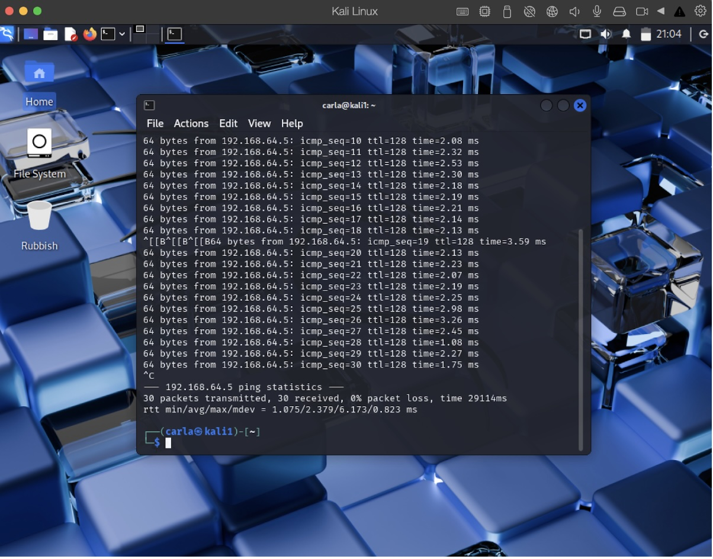

# 🛡️ Metasploitable2 on Mac M-Series: Legacy Pentest Lab on Apple Silicon

**Author:** Carla Vieira | May 2025

---

**Repository Purpose:** To provide a comprehensive guide for setting up a Metasploitable2 penetration testing lab (aka playground) on Apple Silicon (M1-M4) Macs using UTM. This addresses critical virtualization challenges, ensuring that the increasing adoption of high-performance M-Series devices in professional environments (including SOC, Development, and Marketing) does not hinder essential cybersecurity training and testing capabilities.

---

### 📚 Overview

First things first, let's address the elephant in the room: How can you love your new Mac and still be able to ethically hack into a Windows XP environment or have fun exploring Metasploitable2? How can you refine your Blue Team skills using your shiny new Apple Silicon Mac in the most pain-free way?

This project details the process of rebuilding a Metasploitable2 environment on modern Apple Silicon hardware (M1-M4 Macs) using UTM and QEMU. As traditional virtualization solutions like VirtualBox and VMware lost direct compatibility with x86-based virtual machines on these new architectures, accessing legacy testing environments like Metasploitable2 became challenging. This guide solves that, enabling continued hands-on practice with real-world exploits.

This guide ensures cybersecurity practitioners can:
* Run a fully functional Metasploitable2 lab on their M-series Mac.
* Understand UTM virtualization for cybersecurity testing purposes.
* Configure a safe, isolated network for exploit simulation.
* Validate connectivity between an attacker machine (e.g., Kali Linux) and the Metasploitable2 target.

This lab setup guide also supports the practical application of concepts discussed in the blog post: **"[Placeholder: Title of Your Blog Post]"** on [cvcyber.dev]([Placeholder: Direct Link to your cvcyber.dev article]).

---

### 📂 Contents

| File                      | Description                                                                 |
| :------------------------ | :-------------------------------------------------------------------------- |
| `README.md`               | This comprehensive guide for setting up Metasploitable2 on Apple Silicon. |
| `LICENSE`                 | MIT License details for use and attribution.                                |
| `screenshots/` (optional) | Folder containing illustrative screenshots for setup steps.                 |

---

### 🚀 The Guide: Setting up Metasploitable2 on Apple Silicon

**The Challenge with Apple Silicon:**

Setting up proper penetration testing infrastructure is non-negotiable for cybersecurity professionals. However, the shift to Apple’s M1–M4 chips meant popular tools like VirtualBox and VMware lost compatibility with x86-based test environments. This impacted access to valuable legacy systems like Windows XP and, critically, Metasploitable2, hindering legacy exploit simulation. This project leverages **UTM + QEMU** to restore this essential lab functionality directly on Apple Silicon.

**💡 Why Metasploitable2?**

Metasploitable2, generously maintained by Rapid7, is an intentionally vulnerable Linux distribution designed for ethical hacking training and security research.
* **Key Features:** Multiple exploitable services (FTP, SSH, HTTP, etc.), realistic misconfigurations, and a safe, isolated environment.
* **Practice Targets:** Perfect for practicing exploits like MS08-067, SMBv1 vulnerabilities, Heartbleed, and more.

**🧰 What You’ll Need**

* **System Requirements:**
    * Mac with Apple M1, M2, M3, or M4 chip
    * Minimum 4GB RAM (8GB+ recommended)
    * Minimum 10GB free disk space
    * [UTM](https://mac.getutm.app/) installed
* **Software:**
    * Metasploitable2 image (e.g., from [SourceForge](https://sourceforge.net/projects/metasploitable/))

**🛠️ Setup Instructions**

1.  **Install UTM**
    * Visit [UTM's website](https://mac.getutm.app/). It will take you to the App Store.
    * Download and install the latest version for macOS.
 
2.  **Download Metasploitable2**
    * Get it from SourceForge: [https://sourceforge.net/projects/metasploitable/](https://sourceforge.net/projects/metasploitable/)
    * Extract the `.zip` archive and locate the `.vmdk` (virtual disk) file.
3.  **Create a New VM in UTM**
    * Open UTM, click the “+” button, and select **Emulate** (important: not Virtualize for x86 on ARM).
    * Choose **Other** for the Operating System.
    * Under "Boot ISO Image," click "Browse" and initially select **Skip ISO boot**. (You can also leave "Boot Device" as "None" or clear it on the summary screen).
    * Continue through the wizard, adjusting RAM (1GB is fine, 2GB if you have plenty) and disk (this will be replaced).
    * On the **Summary** screen, check "Open VM Settings" before saving, or save and then edit the VM.
4.  **Configure the VM**
    * **General:**
        * Name: `Metasploitable2-M-Series` (or similar)
        * Icon: (Optional - pick a Linux icon)
    * **QEMU (ensure this tab is visible if you chose "Emulate"):**
        * Architecture: `x86_64` (Should be default if emulating)
        * System: `Standard PC (i440FX + PIIX, 2009)` (Default is usually fine)
        * *Crucial:* **Uncheck `UEFI Boot`**. Metasploitable2 uses legacy BIOS.
    * **Drives:**
        * Delete any existing IDE or VirtIO drives that were created by default.
        * Click **New Drive**, select **Import**, then choose the Metasploitable2 `.vmdk` file you extracted. Ensure the interface is set to **IDE**.
    * **Network:**
        * Mode: **Shared Network** or **Bridged** (if you want it on your main LAN and understand the security implications – Shared is often easier and safer for isolated labs).
        * Emulated Network Card: `rtl8139` is a common compatible choice.
5.  **First Boot & Login**
    * Start the VM.
    * Login with default credentials:
        * Username: `msfadmin`
        * Password: `msfadmin`
6.  **Network Configuration & Validation**
    * Inside Metasploitable2, find its IP address: `ifconfig` or `ip a` (look for `eth0`).
    * From your host Mac (or your attacking Kali VM, if also running in UTM and on the same network), ping the Metasploitable2 VM:
        ```bash
        ping <Metasploitable2_IP_Address>
        ```
    * You should receive replies, confirming network connectivity.

  

---

### 🔖 License

This project is licensed under the MIT License - see the [LICENSE](LICENSE) file for details.
© 2025 Carla Vieira

---

### 🌐 About the Author

Carla Vieira is a cybersecurity student and advocate for ethical technology. Her work focuses on bridging technical practice with responsible innovation, including creating accessible guides for essential security tools. More at cvcyber.dev.


